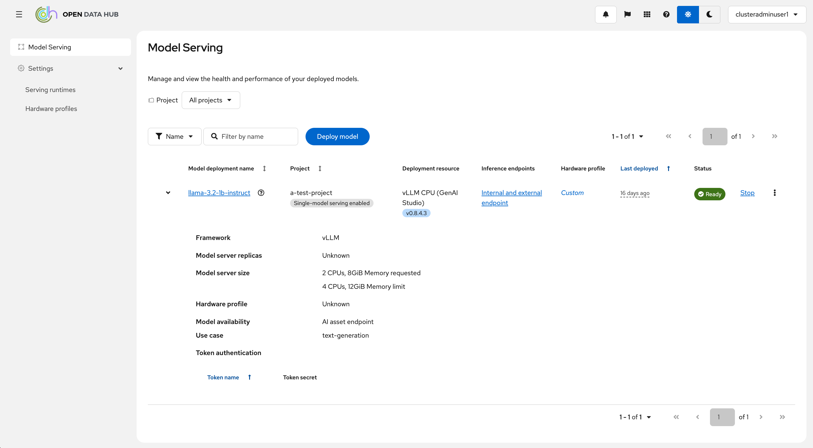
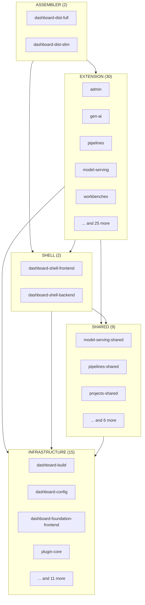

# Package Restructuration

## TL;DR

The monolithic `frontend/` and `backend/` directories have been broken apart into 58 packages under `packages/`. Each feature area — pipelines, workbenches, model serving, and others — is now its own self-contained package with dedicated configuration, tests, and extension entry points. The old top-level directories are gone, replaced by a layered architecture of infrastructure, shared, shell, extension, and assembler packages.

This restructuration enforces clear dependency boundaries between features. Extension packages can no longer quietly import internals from other extensions — they must go through shared packages or extension points. The result is a codebase where each feature can be built, tested, and deployed independently via Module Federation, without pulling in the entire dashboard.

On the infrastructure side, build tooling (`dashboard-build`), shared configuration (`dashboard-config`), and foundation utilities (`dashboard-foundation-frontend`, `dashboard-foundation-backend`) now live in their own packages. The app shell — responsible for loading extensions, rendering the chrome, and serving the backend — lives in `dashboard-shell-frontend` and `dashboard-shell-backend`. Two assembler packages (`dashboard-dist-full`, `dashboard-dist-slim`) compose everything into runnable distributions. This work is a **proof of concept** — it has been validated on OpenShift, while vanilla Kubernetes support is being explored as part of a separate POC.

**Main idea: decompose the remaining monolith into self-contained, independently shippable packages — so they can be recombined into purpose-built distributions tailored to different deployment needs.**

## By the numbers

This is a massive change — over 4,000 files touched in a single commit. The resulting package structure is not optimized and will require further refinement. A change of this magnitude is **strongly discouraged** in practice. In a real-world rollout, the migration should be planned incrementally and executed in small, reviewable steps to minimize friction with ongoing feature work, reduce merge conflicts, and keep the codebase shippable at every stage.

| Metric | Count |
|--------|-------|
| Files changed | 4,013 |
| Lines added | 87,205 |
| Lines deleted | 39,648 |
| Renamed/moved files | 2,297 |
| Modified files | 821 |
| New files | 514 |
| Deleted files | 381 |

### Build output: Full vs. Slim

One of the key benefits of the new architecture is the ability to produce different distributions from the same codebase. The **full** assembler bundles every extension package, while the **slim** assembler includes only a subset. The difference in build output is significant:

| Metric | Full | Slim | Difference |
|--------|------|------|------------|
| Total size | 94 MB | 43 MB | -54% |
| Total files | 868 | 459 | -47% |
| JS files | 287 | 153 | -47% |
| JS size | 16 MB | 7.2 MB | -55% |
| CSS files | 18 | 20 | +11% |
| CSS size | 3.3 MB | 2.5 MB | -24% |
| Source maps | 304 | 173 | -43% |
| SVG assets | 80 | 13 | -84% |
| Font files | 21 | 9 | -57% |

The slim build is roughly **half the size** of the full build, and this is not even optimized. This demonstrates the core value of the assembler model — distributions that only need model serving capabilities, for instance, no longer have to ship the entire dashboard with pipelines, workbenches, distributed workloads, and every other feature baked in.

> **Why does the slim build have more CSS files?** The CSS file count is a webpack chunk-splitting artifact, not an increase in actual CSS content. In the full build, 30 extension packages share many of the same CSS dependencies (PatternFly, foundation styles), so webpack's `splitChunks` optimizer consolidates them into fewer, larger shared chunks. In the slim build, only 4 extensions exist — fewer consumers sharing CSS means less consolidation opportunity, so webpack produces more granular chunks. The total CSS size still drops by 24%; it is just sliced into more pieces.

### Slim distribution in action



The slim distribution assembles only the extension packages needed for this view:

- `@odh-dashboard/hardware-profiles`
- `@odh-dashboard/kserve`
- `@odh-dashboard/model-serving`

## Architecture

The restructured codebase organizes all 58 packages into five tiers. Dependencies flow strictly downward — a package may only import from its own tier or from tiers above it in the diagram. This one-way dependency rule is enforced by ESLint at the import level and by a validation script at the `package.json` dependency level.



> **Dependency rule:** arrows point to what a tier _may_ import from. A package may only depend on its own tier or on tiers below it. Extensions must never import from other extensions.

### Tier descriptions

**Infrastructure** — The foundation layer. Build tooling (`dashboard-build`), shared Module Federation configuration (`dashboard-config`), shared TypeScript and ESLint configuration (`tsconfig`, `eslint-config`, `eslint-plugin`), test infrastructure (`jest-config`, `test-mocks`, `contract-tests`, `cypress`), the plugin system core (`plugin-core`, `plugin-types`, `plugin-template`), browser-side Kubernetes resource operations (`k8s-browser`), and foundation utilities for both frontend and backend (`dashboard-foundation-frontend`, `dashboard-foundation-backend`). These packages have zero knowledge of any feature.

**Shared** — Domain-specific types, hooks, and components that multiple extensions need. For example, `model-serving-shared` provides types and utilities consumed by extensions such as `model-serving`, `kserve`, `model-registry`, `trustyai`, `pipelines`, and `workbenches`. This tier prevents duplication without coupling extensions to each other. A shared package may import from infrastructure and from other shared packages.

**Shell** — The app frame. `dashboard-shell-frontend` renders the navigation chrome, loads extensions, and instantiates the `PluginStore` (defined in `plugin-core`). `dashboard-shell-backend` serves the HTML, proxies API requests, and injects the Module Federation remotes configuration. The shell knows how to load extensions but has no knowledge of what any specific extension does.

**Extension** — The feature layer, and by far the largest tier with 30 packages. Each extension owns everything it needs: pages, routes, components, hooks, and optionally backend routes or a full Go BFF. Extensions are loaded at runtime via Module Federation and gated by feature flags. The critical rule: **extensions must never import from other extensions**. Cross-feature communication happens through extension points defined in `plugin-core`.

Each extension contributes to the dashboard by declaring what it provides. The most common contribution types are:

| Contribution | Description |
|---|---|
| `app.route` | Page routes with lazy-loaded components |
| `app.navigation/href` | Sidebar navigation links |
| `app.area` | Feature area definitions with flags |
| `app.navigation/section` | Sidebar navigation groups |
| `app.task/item` | Task area items (e.g., setup checklist) |
| `app.tab-route/page` | Tabs within tabbed pages |
| `app.context-provider` | React context providers |
| `app.external-redirect` | Redirects to external URLs |
| `app.route/redirect` | Internal route redirects |
| `app.extension/override` | Overrides for other extensions |
| `app.status-provider` | Status hooks for nav items |

Beyond these core types, extensions can also define domain-specific extension points — for example, `model-serving` defines points like `model-serving.platform`, `model-serving.deployment/wizard-field2`, and `model-serving.metrics`, allowing other extensions (like `kserve` or `trustyai`) to plug into the model serving workflow without direct imports.

**Assembler** — The composition layer. Assembler packages select which extensions to include and produce a runnable distribution. `dashboard-dist-full` bundles all extensions for the complete RHOAI/ODH experience. `dashboard-dist-slim` bundles only a subset for leaner deployments. Adding a new distribution is as simple as creating a new assembler package with a different set of extension dependencies.

## What changed

Here is the repository structure before and after the restructuration:

### Before

```
odh-dashboard/
├── frontend/                          # Everything frontend — one giant app
│   ├── config/                        #   Webpack, MF, dotenv config
│   ├── src/
│   │   ├── app/                       #   Shell, chrome, routing, theme
│   │   ├── api/                       #   All browser-side API helpers
│   │   ├── concepts/                  #   All domain logic (hooks, context, types)
│   │   │   ├── areas/
│   │   │   ├── connectionTypes/
│   │   │   ├── hardwareProfiles/
│   │   │   ├── modelServing/
│   │   │   ├── notebooks/
│   │   │   ├── pipelines/
│   │   │   ├── projects/
│   │   │   └── ...
│   │   ├── pages/                     #   All page components
│   │   │   ├── clusterSettings/
│   │   │   ├── connectionTypes/
│   │   │   ├── distributedWorkloads/
│   │   │   ├── hardwareProfiles/
│   │   │   ├── home/
│   │   │   ├── modelServing/
│   │   │   ├── pipelines/
│   │   │   ├── projects/
│   │   │   ├── storageClasses/
│   │   │   └── ...
│   │   └── __mocks__/                 #   All test mocks
│   └── package.json
├── backend/                           # Everything backend — one server
│   └── src/
│       ├── routes/api/                #   All API routes
│       │   ├── builds/
│       │   ├── cluster-settings/
│       │   ├── config/
│       │   ├── connection-types/
│       │   ├── notebooks/
│       │   ├── prometheus/
│       │   ├── service/pipelines/
│       │   └── ...
│       └── utils/                     #   Server utilities
└── packages/                          # Only federated modules + tooling
    ├── gen-ai/
    ├── model-registry/
    ├── maas/
    └── ...
```

### After

```
odh-dashboard/
├── packages/
│   ├── dashboard-build/               # Infrastructure — webpack, MF, dotenv
│   ├── dashboard-config/              # Infrastructure — shared MF config
│   ├── dashboard-foundation-frontend/ # Infrastructure — areas, design, core utilities
│   ├── dashboard-foundation-backend/  # Infrastructure — proxy, DSC helpers
│   ├── plugin-core/                   # Infrastructure — extension system, PluginStore
│   ├── plugin-types/                  # Infrastructure — extension type definitions
│   ├── k8s-browser/                   # Infrastructure — K8s resource operations
│   ├── test-mocks/                    # Infrastructure — shared mock data
│   ├── eslint-config/                 # Infrastructure — lint rules
│   ├── jest-config/                   # Infrastructure — test config
│   │
│   ├── model-serving-shared/          # Shared — model serving types & hooks
│   ├── pipelines-shared/              # Shared — pipeline utilities
│   ├── projects-shared/               # Shared — project context
│   ├── hardware-profiles-shared/      # Shared — hardware profile utilities
│   ├── connection-types-shared/       # Shared — connection type hooks
│   ├── ...                            # Shared — 4 more *-shared packages
│   │
│   ├── dashboard-shell-frontend/      # Shell — app chrome, routing, extension loading
│   ├── dashboard-shell-backend/       # Shell — server, core routes, MF proxy
│   │
│   ├── pipelines/                     # Extension — pages, concepts, backend routes
│   ├── workbenches/                   # Extension — pages, concepts, backend routes
│   ├── model-serving/                 # Extension — pages, concepts
│   ├── connection-types/              # Extension — pages, concepts, backend routes
│   ├── hardware-profiles/             # Extension — pages, concepts
│   ├── home/                          # Extension — home page
│   ├── admin/                         # Extension — admin settings
│   ├── gen-ai/                        # Extension — Gen AI (with BFF)
│   ├── model-registry/                # Extension — Model Registry (with BFF)
│   ├── ...                            # Extension — 21 more feature packages
│   │
│   ├── dashboard-dist-full/           # Assembler — all extensions
│   └── dashboard-dist-slim/           # Assembler — subset of extensions
```

The key difference: in the old structure, adding a feature meant touching files scattered across `frontend/src/pages/`, `frontend/src/concepts/`, `frontend/src/api/`, and `backend/src/routes/`. In the new structure, a feature lives entirely within its own package — pages, concepts, API helpers, and backend routes all in one place.

## What stays the same

This restructuration changes where code lives, not how it works. A few things worth calling out:

- **Tech stack** — React 18, TypeScript, PatternFly v6, Fastify, Webpack, and Module Federation. Nothing was swapped out.
- **Dev workflow** — `npm install` at the root, `npm run dev` to start the dev server, `npm run build` to build. Turbo orchestrates tasks across packages the same way it did before.
- **Test frameworks** — Jest for unit tests, Cypress for mock and E2E tests, contract tests for BFF validation. The test infrastructure packages (`jest-config`, `cypress`, `contract-tests`) were already in `packages/` and remain unchanged.
- **CI/CD pipelines** — Tekton and GitHub Actions workflows continue to run the same checks. Some workflow files received minor path updates to reflect the new package locations, but the pipeline structure is the same.
- **BFF architecture** — Packages with Go backends (`gen-ai`, `model-registry`, `maas`, `automl`, `autorag`, `mlflow`, `eval-hub`) keep their `bff/` directories and the same routing, middleware, and authentication patterns.
- **Module Federation** — The runtime loading flow is identical: the shell discovers remotes, loads their extensions, and merges them into a single `PluginStore`. Packages that were already federated (`gen-ai`, `model-registry`, `maas`, etc.) required no changes to their MF configuration.
- **Extension system** — `plugin-core` extension points, feature flags, `useExtensions()` / `useResolvedExtensions()` hooks, and the `PluginStore` all work exactly as before.
- **Coding conventions** — ESLint rules, Prettier formatting, TypeScript strict mode, and PatternFly styling guidelines remain the same. The only addition is the tier-restriction ESLint rule that enforces the new package boundaries.

## @openshift dependencies removal

One notable side effect of the restructuration is the removal of the `@openshift/dynamic-plugin-sdk` and `@openshift/dynamic-plugin-sdk-utils` packages from the direct dependency tree. These two libraries previously provided the plugin system types (`Extension`, `CodeRef`, `LoadedExtension`), the `PluginStore`, and the Kubernetes resource helpers (`k8sGetResource`, `k8sListResourceItems`, etc.).

They have been replaced by two internal packages:

| Before | After | What it provides |
|--------|-------|------------------|
| `@openshift/dynamic-plugin-sdk` | `@odh-dashboard/plugin-core` / `@odh-dashboard/plugin-types` | Extension types, `PluginStore`, `useExtensions`, `useResolvedExtensions`, `LazyCodeRefComponent`, and all extension point definitions |
| `@openshift/dynamic-plugin-sdk-utils` | `@odh-dashboard/k8s-browser` | Kubernetes resource operations (`k8sGetResource`, `k8sListResource`, `k8sCreateResource`, `k8sPatchResource`, `k8sDeleteResource`), fetch helpers, K8s client configuration, and error handling |

This change has a few practical benefits:

- **Provider portability** — removing the hard dependency on the OpenShift SDK is a prerequisite for running the dashboard on other Kubernetes providers like AKS, EKS, or GKE. The internal `k8s-browser` package talks to the standard Kubernetes API, not OpenShift-specific endpoints.
- **No external SDK dependency** — the plugin system and K8s helpers are now fully owned by the project, removing the coupling to the OpenShift SDK release cycle.
- **Tailored API surface** — `k8s-browser` exposes exactly what the dashboard needs for browser-side Kubernetes operations, without carrying unused SDK features.
- **Consistent import paths** — all internal imports now follow the `@odh-dashboard/*` naming convention, making it easier to reason about where code comes from.

No source files or `package.json` dependencies reference `@openshift` directly anymore.

## Migration patterns

The old codebase had two top-level directories: `frontend/` (the React app) and `backend/` (the Node.js server). Both were monolithic — every feature lived side by side in the same source tree. The restructuration broke them apart following a few consistent patterns.

### Frontend pages became extension packages

Each subdirectory under `frontend/src/pages/` mapped to a feature-specific extension package:

| Old location (`frontend/src/pages/`) | New package |
|---|---|
| `projects/` | `workbenches` |
| `pipelines/` | `pipelines` |
| `modelServing/` | `model-serving` |
| `hardwareProfiles/` | `hardware-profiles` |
| `connectionTypes/` | `connection-types` |
| `storageClasses/` | `storage-classes` |
| `distributedWorkloads/` | `distributed-workloads` |
| `home/` | `home` |
| `clusterSettings/` | `cluster-settings` |
| `notebookController/` | `notebook-controller` |
| `exploreApplication/` | `explore-applications` |
| `learningCenter/` | `learning-center` |
| `BYONImages/` | `workbench-images` |
| `modelRegistrySettings/` | `admin` |

### Frontend concepts followed their features

The `frontend/src/concepts/` directory held domain logic — hooks, context providers, API helpers, and types. Each concept directory moved into the extension package that owns that domain:

| Old location (`frontend/src/concepts/`) | New package |
|---|---|
| `pipelines/` | `pipelines` |
| `notebooks/`, `projects/` | `workbenches` |
| `connectionTypes/` | `connection-types` / `connection-types-shared` |
| `hardwareProfiles/` | `hardware-profiles` / `hardware-profiles-shared` |
| `distributedWorkloads/` | `distributed-workloads` / `distributed-workloads-shared` |
| `modelServing/`, `modelServingKServe/` | `model-serving` / `model-serving-shared` |
| `modelRegistry/` | `model-registry` |
| `trustyai/` | `trustyai` |
| `mlflow/` | `mlflow-shared` |
| `areas/`, `k8s/`, `design/`, `userConfigs/` | `dashboard-foundation-frontend` |
| `topology/` | `pipelines` |

When a concept was used by multiple extensions, it was split into a `*-shared` package (shared tier) instead of landing in a single extension.

### Backend routes distributed across packages

The old `backend/src/routes/api/` directory contained all API route handlers in one place. These routes were distributed based on which feature they serve:

| Old location (`backend/src/routes/api/`) | New package |
|---|---|
| `notebooks/`, `builds/` | `workbenches/src/backend/routes/` |
| `connection-types/` | `connection-types/src/backend/routes/` |
| `service/pipelines/`, `service/mlmd/`, `ray-job-logs/` | `pipelines/src/backend/routes/` |
| `config/`, `cluster-settings/`, `envs/`, `health/`, `k8s/`, `namespaces/`, `status/`, `docs/`, `quickstarts/`, and others | `dashboard-shell-backend/src/routes/` |
| `module-federation` proxy | `dashboard-shell-backend/src/routes/` |

Feature-specific routes now live inside their extension package under `src/backend/routes/`. Core routes that serve the overall application (config, health, K8s proxy, etc.) stayed in the shell backend.

Extension packages declare their backend routes by adding a `"./routes"` export to their `package.json`, pointing to the route entry file (e.g., `"./routes": "./src/backend/routes/index.ts"`). At startup, `dashboard-shell-backend` calls `discoverPluginRoutes()`, which reads the build-time plugin manifest (or falls back to scanning workspace packages) and collects every package that has a `"./routes"` export. It then filters this list based on which extensions the assembler selected via `pluginPackages`. The resolved route entry files are registered directly via `require()` and `fastify.register()` alongside the shell's own built-in routes (which use `@fastify/autoload` for directory-based loading). The result: each extension's API endpoints are automatically available without any manual wiring in the shell.

### Frontend API layer split

The `frontend/src/api/` directory contained browser-side API helpers. These were split based on what they serve:

| Old location (`frontend/src/api/`) | New package |
|---|---|
| `k8s/` | `k8s-browser` |
| `pipelines/` | `pipelines` |
| `prometheus/` | `workbenches` |
| `modelRegistry/` | `model-registry` |
| `trustyai/` | `trustyai` |
| `featureStore/` | `workbenches` |

### Shared infrastructure extracted

Code that served the entire app rather than a specific feature moved into infrastructure packages:

| Old location | New package |
|---|---|
| `frontend/src/__mocks__/` | `test-mocks` |
| `frontend/src/app/` (shell, chrome, routing) | `dashboard-shell-frontend` |
| `frontend/src/concepts/areas/` | `dashboard-foundation-frontend` |
| `frontend/config/` (webpack, MF, dotenv) | `dashboard-build` |
| `backend/src/utils/proxy.ts`, `backend/src/utils/dsc.ts` | `dashboard-foundation-backend` |

These mappings reflect the decisions made for this proof of concept — not a final, optimized layout. Some packages may be too coarse (e.g., `workbenches` absorbed several loosely related areas), others may be too granular, and some boundary decisions will likely shift as the real migration is planned. The goal here was to demonstrate that the decomposition is feasible, not to produce the definitive package structure.

## Known limitations

This is a proof of concept. It proves the architecture works, but leaves several rough edges that a production rollout would need to address.

### Package sizing is uneven

Some packages ended up significantly larger than others. The top five by source file count:

| Package | Files |
|---|---|
| `pipelines` | 520 |
| `dashboard-foundation-frontend` | 506 |
| `model-serving` | 378 |
| `workbenches` | 263 |
| `feature-store` | 235 |

Packages like `pipelines` and `dashboard-foundation-frontend` are essentially monoliths within the monorepo. A production migration would need to evaluate whether these should be further decomposed. Conversely, some smaller packages (e.g., `cluster-settings`, `learning-center`) might make more sense merged into a neighboring package rather than standing alone.

### Test coverage gaps

23 packages currently have no unit tests. Many of these are infrastructure or tooling packages where tests may not be critical (`tsconfig`, `eslint-config`, `plugin-template`, `dashboard-dist-full`), but others — like `admin`, `connection-types-shared`, `model-serving-shared`, `pipelines-shared`, `dashboard-foundation-backend`, and `trustyai` — carry real logic that should be tested. Ensuring test coverage across all packages is a prerequisite for a production rollout.

### Intra-package circular imports

While there are no circular dependencies between packages (the tier model prevents that), there are approximately 191 circular import chains within individual packages. These are inherited from the original codebase — the restructuration moved code but did not refactor it. Cleaning these up would improve build reliability and make future package splits easier.

### No incremental migration path

This POC was done as a single large commit. A real migration would need to be broken into incremental steps that can be reviewed and merged independently, keeping the codebase shippable at every stage. The strategy for that incremental path — which packages to extract first, how to handle the transition period where old and new structures coexist — has not been defined yet.

### Implicit coupling between extensions

The tier model enforces that extensions must not import from other extensions — and at the `package.json` dependency level, this rule holds. No extension has a runtime or type-only import from another extension. However, there is a subtler form of coupling: **route-level dependencies**. Several extensions navigate to routes owned by other extensions using hardcoded path strings through links/breadcrumbs:

- `home` links to `/projects` (owned by `workbenches`)
- `model-serving` links to `/projects` (owned by `workbenches`)
- `pipelines` links to `/projects/:ns?section=...` (owned by `workbenches`)
- `feature-store` links to `/projects` (owned by `workbenches`)

These route references create an invisible dependency: if the target extension is not included in a given distribution, the link leads to a 404. This coupling is not caught by ESLint or the tier validation scripts. A production rollout should consider introducing a route registry or shared route constants so that extensions can reference each other's routes without hardcoding paths, and so that missing routes can be detected at build time or handled gracefully at runtime.

### About modal and feature flags are not distribution-aware

The About modal and the feature flags modal currently display all components and all feature flags, regardless of which extensions are actually loaded in the distribution. This means a slim distribution still shows feature flags for pipelines, distributed workloads, and other features that are not included. Ideally, these modals should reflect only the extensions that are actually present — showing a flag for a feature that cannot be enabled is confusing and misleading.

### Shared packages need refinement

The boundary between what belongs in a `*-shared` package versus what stays in the extension is not always clear. Some shared packages may contain code that only one extension actually uses, while some extensions may still hold code that should be shared. These boundaries should be refined based on actual import analysis once the structure stabilizes.

### Shell UX is not customizable per distribution

The shell currently ships a fixed UX: top bar, user dropdown, sidebar navigation, and content area. Every distribution gets the same chrome. If different distributions need a different layout — for example, a slim deployment that removes the sidebar in favor of a tab-based navigation, or a white-labeled version with a custom header — the shell itself would need to be decomposed into smaller, swappable pieces. This is out of scope for this POC but worth planning for if distribution-specific UX divergence becomes a requirement.

### Foundation frontend is a gravity well

`dashboard-foundation-frontend` is the second-largest package (506 files) and depended on by 45 other packages. It risks becoming a shared-everything catch-all that undermines the tier model — anything that does not obviously belong to a specific feature gravitates here. A production rollout should define a clear scope policy for this package and consider splitting domain-agnostic utilities (design tokens, table helpers, form components) from project/area concepts that could live in their own shared packages.

### Frontend and backend co-location in extensions

Seven extensions (`connection-types`, `feature-store`, `gen-ai`, `model-registry`, `model-serving`, `pipelines`, `workbenches`) bundle both frontend code (`src/pages/`) and backend code (`src/backend/routes/`) in the same package. This means a CSS change in a component marks the backend dirty in Turbo's dependency graph, and you cannot deploy the frontend independently of the backend within the same extension. Splitting each into `<feature>` (frontend) and `<feature>-backend` packages would give finer-grained build and deploy control.

### Shared packages can become implicit coupling channels

Shared packages are designed to prevent extension-to-extension imports, but they can serve as a backdoor for indirect coupling. If a `*-shared` package accumulates logic specific to how a single extension works, it effectively couples every consumer to that extension's internals through the shared layer. Without governance, shared packages risk becoming the new `concepts/` directory. A production rollout should enforce that shared packages only contain types, hooks, and utilities consumed by two or more extensions, validated by periodic import analysis.

### No build-time validation of extension completeness

The `pluginPackages` list in an assembler selects which extensions to include, but nothing validates that the selected set is coherent. For example, nothing prevents an assembler from including `kserve` without `model-serving`, even though `kserve` contributes `model-serving.platform` extension points that are meaningless without `model-serving` to consume them. A production rollout should consider allowing extensions to declare optional peer dependencies on other extensions, with a build-time validation step that warns when a distribution is missing expected peers.

### Type-only imports bypass tier enforcement

The ESLint tier rule explicitly allows `import type` across any tier boundary. While types are erased at runtime, they still create a coupling — if extension A has `import type { Foo } from '@odh-dashboard/extension-b'`, then A's compilation depends on B's type definitions. Refactoring B can break A's build even though there is no runtime dependency. This is a deliberate design choice (types need to flow freely to keep the extension point contracts type-safe), but it weakens the "extensions must never import from other extensions" guarantee at the type level. A production rollout should monitor cross-extension type imports and consider promoting frequently shared types into `*-shared` packages to make the coupling explicit and intentional.

## FAQ

**Where did my file go?**
The general rule: pages moved to their feature's extension package, concepts moved with their feature (or into a `*-shared` package if used by multiple extensions), backend routes moved into the extension that owns them, and app-wide utilities moved into `dashboard-foundation-frontend` or `dashboard-shell-*`. The [Migration patterns](#migration-patterns) section has detailed mapping tables.

**How do I import from another package?**
Use the `@odh-dashboard/<package-name>` scope followed by the module path. For example: `import { pipelinesBaseRoute } from '@odh-dashboard/pipelines-shared/concepts/pipelines/routes'`. Never use relative paths across package boundaries.

**Why can't extensions depend on each other?**
If extension A imports from extension B, then A cannot exist in a distribution without B. This defeats the purpose of the assembler model — the whole point is to pick and choose which extensions to include. Cross-feature communication should go through extension points in `plugin-core` or shared packages in the shared tier.

**How do I add a new feature?**
Create a new extension package under `packages/`. Define an `extensions.ts` that declares routes, navigation items, and area flags. Add the package as a dependency to the assembler(s) that should include it.

**How do I share code between two extensions?**
Create or use an existing `*-shared` package in the shared tier. Move the shared types, hooks, or components there. Both extensions then import from the shared package. Never import directly from one extension to another.

**How do I run tests for a single package?**
Use Turbo to filter: `npx turbo run test-unit --filter=@odh-dashboard/<package-name>`. Each package has its own `jest.config.ts` and can also be tested directly with `npm run test-unit` from within the package directory.

**How do I start the dev server?**
From the root, the following commands are available:

| Command | Description |
|---|---|
| `npm run dev` | Start the full distribution dev server (local backend) |
| `npm run dev:slim` | Start the slim distribution dev server (local backend) |
| `npm run start:dev:ext` | Start the full distribution dev server against an external cluster |
| `npm run start:dev:slim:ext` | Start the slim distribution dev server against an external cluster |

**Does this change affect existing PRs?**
Yes — significantly. Since the restructuration moves nearly every file, any open PR targeting the old `frontend/` or `backend/` directories would conflict. This is one of the key reasons why the production rollout should be done incrementally rather than as a single large change.

**What is the difference between full and slim distributions?**
The full distribution (`dashboard-dist-full`) includes every extension package — the complete RHOAI/ODH dashboard experience. The slim distribution (`dashboard-dist-slim`) includes only a subset of extensions, producing a smaller bundle tailored to deployments that do not need every feature. See the [build comparison table](#build-output-full-vs-slim) for size differences.

**Can I create a custom distribution?**
Yes. Create a new assembler package under `packages/` and list the desired extensions in the `pluginPackages` array in its `package.json` — that is all it takes to include or exclude a feature. The build tooling in `dashboard-build` handles discovery, bundling, and manifest generation automatically.

Assemblers can also **override** the behavior of imported extensions without modifying them. The slim distribution already does this — it uses `app.extension/override` to patch navigation items (e.g., relocating the serving runtimes and hardware profiles links to a different section) and `app.route/redirect` to remap routes. This means a distribution can tailor the UI to its needs while reusing extensions as-is.

## How this was tested

The restructuration has been validated through automated scripts and manual verification:

- **Linting** — `npm run lint` passes across all packages with zero errors, confirming that import paths, tier restrictions, and coding conventions are respected.
- **Type checking** — `npm run type-check` passes, verifying that all cross-package type references resolve correctly after the move.
- **Unit tests** — `npm run test` passes, confirming that existing unit tests continue to work in their new package locations.
- **Production builds** — both `dashboard-dist-full` and `dashboard-dist-slim` build successfully with `npm run build`, producing valid bundles.
- **Manual sanity checks** — both the full and slim distributions have been manually tested in a browser, verifying that pages load, navigation works, and extensions render correctly.

Cypress mock and E2E tests have **not** been run against this restructuration. A full Cypress pass would be a prerequisite before moving beyond the POC stage.

## Glossary

| Term | Definition |
|---|---|
| **Assembler** | A package that selects which extensions to include and produces a runnable distribution. Think of it as a recipe that picks ingredients (extensions) and bakes them into a deployable application. |
| **Distribution** | The final, built output of an assembler — a set of static assets (JS, CSS, HTML) ready to be served. Different assemblers produce different distributions. |
| **Extension** | A self-contained feature package that contributes UI pages, navigation items, routes, and optionally backend routes to the dashboard. Extensions are loaded at runtime via Module Federation. |
| **Extension point** | A typed contract defined in `plugin-core` (or in a shared package) that allows one extension to provide functionality that another extension consumes — without direct imports between them. |
| **Infrastructure** | The bottom tier of packages. Foundation utilities, build tooling, test configuration, and the plugin system core. These packages have no knowledge of any feature. |
| **Shell** | The app frame — the top bar, sidebar navigation, and content area. The shell loads extensions and provides the runtime infrastructure but has no feature-specific code. |
| **Shared package** | A `*-shared` package in the shared tier that provides domain types, hooks, or components consumed by multiple extensions. Prevents code duplication without coupling extensions to each other. |
| **Tier** | One of five architectural layers (infrastructure, shared, shell, extension, assembler) that enforce a one-way dependency flow. A package may only import from its own tier or from tiers below it. |
