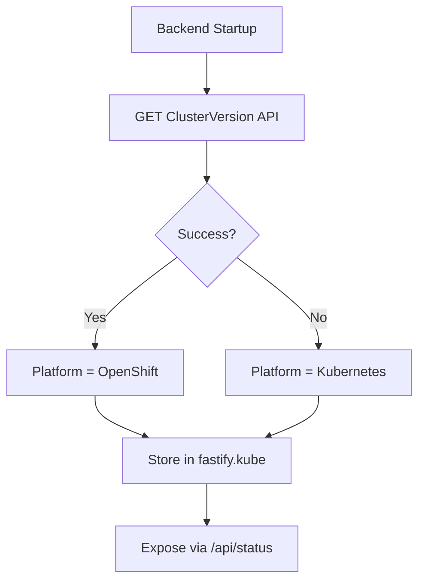

# Running ODH Dashboard Standalone

## TL;DR

ODH Dashboard is tightly coupled to OpenShift, its operator stack, and a constellation of CRDs that don't exist on vanilla Kubernetes. This POC cuts those ties so the dashboard can run on Kind or on a standalone OpenShift cluster, with no operator dependencies. It is the first step toward making the dashboard portable across cloud providers like EKS, AKS, and GKE.

The core idea is runtime platform detection. The backend probes the ClusterVersion API at startup, decides whether it is running on OpenShift or plain Kubernetes, and guards every OpenShift-specific code path (Routes, OAuth, Projects, Groups, ConsoleLinks) behind that check.

A Helm chart packages the dashboard itself, mock infrastructure services, and sample data. The deploy scripts separately pre-install 26 CRDs (4 ODH CRDs and 22 stubs) that vanilla K8s needs. Separate value files target Kind and OpenShift. The default Kind deployment includes observability tabs, pipeline views, and model serving, all populated with realistic sample data. Model Registry and MaaS are optional and require plugin images to be built or pulled from a registry.

## Introduction

ODH Dashboard normally runs as part of the Open Data Hub or Red Hat OpenShift AI operator stack on OpenShift. The operator manages CRD installation, RBAC, component lifecycle, and inter-service wiring. That works well on OpenShift, but it means the dashboard simply cannot run anywhere else. Deploying it on EKS, AKS, GKE, or even a plain Kind cluster is not possible without significant changes.

This POC is the first step toward changing that. It decouples the dashboard from OpenShift-specific APIs and validates that it can run on standard Kubernetes. Kind serves as the test vehicle for vanilla K8s, while standalone OpenShift (without the ODH operator) validates the abstraction layer on the original platform.

Along the way, this work also opens up practical benefits: local development without an OpenShift cluster, demos in environments where the full operator stack is unavailable, faster iteration on frontend/backend changes, and easier onboarding for contributors who may not have OpenShift experience.

### Goals

The target was a single-command deployment on Kind or standalone OpenShift with no dependency on ODH/RHOAI operators. All major dashboard features should be visible and navigable (backed by mock infrastructure), with realistic sample data covering notebooks, pipelines, model serving, model registry, and MaaS. Developers should be able to iterate with hot-reload against the local cluster. Most importantly, the abstractions introduced here should generalize to any conformant Kubernetes distribution.

### Non-Goals

This is not production-ready. Mock services return static data, there is no real multi-user authentication on Kind, and cloud-provider-specific integrations (EKS IAM, AKS Active Directory, GKE Workload Identity) are deferred to a later stage.

## Prerequisites

| Tool | Purpose | Tested on |
|------|---------|-----------|
| Docker or Podman | Container runtime for Kind nodes and image builds | Docker 28.5.1 / Podman 5.1.1 |
| Kind | Local Kubernetes cluster | 0.30.0 |
| kubectl | Kubernetes CLI | 1.32.1 |
| kustomize | CRD pre-install during deployment | 5.6.0 |
| Helm | Chart rendering and deployment | 4.1.4 |
| Node.js | Building the dashboard (if not using pre-built images) | 22.22.0 |
| Go | Building BFF services for plugins (optional) | 1.24.4 |

## Architecture Overview

The following sections break down each layer of the solution.

### Platform Detection

The foundation of the entire POC is a single question the backend asks at startup: "Is this OpenShift?" It answers by probing the `config.openshift.io/v1` ClusterVersion API. If the API responds, the platform is OpenShift; otherwise, the cluster is treated as plain Kubernetes. The result is stored in `fastify.kube.platform` and propagated to the frontend via the `/api/status` endpoint into the Redux store. Every platform-specific code path in the application branches on this value.



### Deployment Topology on Kind

Items marked with `[service]` are real Deployments with running pods. Items marked with `[stub CR]` are Kubernetes custom resources with no controller behind them. Some stub CRs have their status subresource patched by `seed-data.sh` (noted where applicable); others are deployed with inline status in the Helm template.

```
Kind Cluster (odh-dashboard)
├── Namespace: odh-dashboard
│   ├── odh-dashboard          [service]   Dashboard backend + frontend
│   ├── data-science-perses    [service]   Perses observability dashboard
│   ├── prometheus             [service]   Metrics collection + Thanos sidecar
│   ├── thanos-querier         [service]   Metrics query layer
│   ├── model-registry-ui      [service]   Model Registry plugin (optional)
│   ├── model-registry-server  [service]   Registry REST proxy (optional)
│   ├── model-catalog-server   [service]   Model Catalog server (optional)
│   ├── model-registry-db      [service]   PostgreSQL (optional)
│   ├── maas-ui                [service]   MaaS plugin (optional)
│   ├── Ingress                            NGINX → odh-dashboard.127.0.0.1.nip.io
│   ├── OdhApplications        [stub CR]   Application catalog entries (8 apps)
│   ├── HardwareProfiles       [stub CR]   Small, Medium, Large-GPU
│   ├── ModelRegistries        [stub CR]   default-registry, team-nlp-registry
│   └── MaaS resources         [stub CR]   MaaSModelRef, MaaSSubscription, MaaSAuthPolicy (status patched)
│
├── Namespace: sample-project
│   ├── mock-pipeline-server   [service]   NGINX serving static pipeline API responses
│   ├── mock-mlmd-server       [service]   MLMD gRPC + Envoy proxy
│   ├── DataSciencePipelinesApplication  [stub CR]   DSPA (status patched)
│   ├── Notebook               [stub CR]   Sample notebook (my-data-science-workbench)
│   ├── ServingRuntime         [stub CR]   vLLM runtime definition
│   └── InferenceServices      [stub CR]   llama-3-8b, mistral-7b (status patched)
│
└── Cluster-scoped
    ├── CRDs                   (4 ODH CRDs from manifests/common/crd/ + 22 stubs from manifests/overlays/kind/crds/, pre-installed by deploy scripts)
    ├── ClusterRoles           Dashboard RBAC
    └── DataScienceCluster     [stub CR]   Component statuses (status patched)
```

### OpenShift vs Kubernetes Feature Matrix

Once platform detection is in place, every OpenShift-specific feature needs an alternative or a graceful fallback. The table below summarizes how each feature behaves across platforms. These abstractions are not Kind-specific; the same behavior would apply on EKS, AKS, GKE, or any other conformant cluster.

| Feature | OpenShift | Kubernetes |
|---------|-----------|-------------------|
| Networking | Routes (TLS termination) | Ingress (controller-agnostic) |
| Projects / Namespaces | Projects API | Namespaces with annotations |
| Authentication | OAuth proxy + user tokens | Service account identity |
| Admin detection | SelfSubjectAccessReview | `ADMIN_USERS` env var (if unset: allow all) |
| Groups | OpenShift Groups API | Skipped (returns empty) |
| Console links | ConsoleLink CRD | Skipped |
| App launcher | OpenShift Console + OCM links visible | Entire component hidden |
| Resource watchers | DashboardConfig, ClusterStatus, Applications, Docs + Auth, Subscriptions, QuickStarts, Builds, ConsoleLinks | DashboardConfig, ClusterStatus, Applications, Docs |
| DSC status | Real DataScienceCluster v2 | Returns null (treated as v1 Operator fallback) |
| WebSocket auth | `base64.binary.k8s.io` always present; bearer subprotocol carries the OAuth user token | Same mechanism; bearer subprotocol carries the service-account token (via `directCallUtils.ts` fallback) |

## Backend and Frontend Adaptations

The feature matrix above looks clean in a table, but making it work required changes across a significant number of files. The good news is that almost every change follows the same pattern: check `fastify.kube.platform` (backend) or the Redux `platform` state (frontend), and branch accordingly.

### Backend Changes

The journey starts at startup. In `backend/src/plugins/kube.ts`, the Kubernetes client initialization now probes the ClusterVersion API and records the result. Any OpenShift-specific resource fetches (like the console-config ConfigMap) are guarded behind `if (platform === PlatformType.OpenShift)`.

Networking is the most visible difference between platforms. OpenShift uses Routes; everything else uses Ingress. In `backend/src/utils/componentUtils.ts`, a new `getURLForIngress()` function mirrors the existing `getURLForRoute()`, and the `getLink()` helper tries Routes first on OpenShift, then falls back to Ingress.

Authentication required several coordinated changes. On OpenShift, the dashboard relies on OAuth proxy tokens and OpenShift user lookups. On K8s, none of that exists. Admin detection in `adminUtils.ts` falls back to an `ADMIN_USERS` env var when OpenShift groups are unavailable. Identity extraction in `userUtils.ts` falls back to the service account from the kube config when no OAuth token is present. Route security in `route-security.ts` calls `isUserAdmin` indirectly and skips the OpenShift user existence check entirely on K8s.

Resource watchers in `backend/src/utils/resourceUtils.ts` are conditionally created. OpenShift-only watchers (Auth, Subscriptions, QuickStarts, Builds, ConsoleLinks) simply don't start on K8s, and their getters return `undefined` or empty arrays. Direct API calls (`directCallUtils.ts`) fall back to service-account credentials from the kube config when no OAuth token is present.

WebSocket connections (`backend/src/routes/wss/k8s/index.ts`) always include `base64.binary.k8s.io` as a subprotocol. The handler calls `getDirectCallOptions` to obtain request options, then extracts any `Authorization: Bearer` token. When a token is found, the bearer subprotocol is prepended. On OpenShift this is the OAuth user token; on vanilla K8s, `getDirectCallOptions` supplies the service-account token, so the bearer subprotocol carries a service-account identity instead of a user identity.

### Frontend Changes

The frontend mirrors the platform detection via Redux. A `PlatformType` enum in `frontend/src/redux/types.ts` is populated from the `/api/status` response, and components branch on it.

The biggest change is in project handling (`frontend/src/api/k8s/projects.ts`). A `useProjectModel()` hook returns `NamespaceModel` on K8s and `ProjectModel` on OpenShift. Create, delete, and update functions use Namespaces with OpenShift-compatible annotations so the rest of the UI works without changes.

Several features simply return empty data on K8s: Groups (`groups.ts`) return an empty array, ConsoleLinks (`useWatchConsoleLinks.tsx`) return an empty list, and the app launcher (`AppLauncher.tsx`) hides OpenShift Console and OCM links. The area context (`AreaContext.tsx`) learned to distinguish `dscStatus === null` (CRD not installed, expected on K8s) from `dscStatus === {}` (CRD exists but empty, which indicates an error).

## Helm Chart

With the backend and frontend ready to run on either platform, the next piece is deployment packaging. The Helm chart at `charts/odh-dashboard/` packages the dashboard, plugin UIs, mock services, and sample data. CRD stubs are pre-installed separately by the deploy scripts from `manifests/`.

### Chart Structure

```
charts/odh-dashboard/
├── Chart.yaml
├── values.yaml                    # Default values
├── values-kind.yaml               # Kind overrides
├── values-openshift.yaml          # OpenShift overrides
└── templates/
    ├── _helpers.tpl               # Template helpers
    ├── NOTES.txt                  # Post-install instructions
    ├── deployment.yaml            # Main dashboard deployment
    ├── service.yaml               # ClusterIP service
    ├── ingress.yaml               # NGINX Ingress (Kind)
    ├── route.yaml                 # OpenShift Route
    ├── serviceaccount.yaml
    ├── clusterrole.yaml           # Dashboard + data-science-groups cluster roles
    ├── clusterrolebinding.yaml    # 3 bindings (dashboard, auth-delegator, data-science-groups)
    ├── role.yaml                  # Namespace-scoped roles
    ├── rolebinding.yaml
    ├── odhdashboardconfig.yaml    # Dashboard feature flags
    ├── federation-configmap.yaml  # Module Federation routing
    ├── mocks/
    │   ├── perses-server.yaml     # Observability stack
    │   ├── pipeline-server.yaml   # Mock pipeline API
    │   └── mlmd-server.yaml       # ML Metadata server
    ├── plugins/
    │   ├── model-registry-ui.yaml
    │   ├── model-registry-server.yaml
    │   └── maas-ui.yaml
    └── sample-data/
        └── sample-data.yaml       # Auth, hardware profiles, notebooks, etc.
```

> **Note:** The `mocks/` directory name is slightly misleading. Only the pipeline server is a true mock (NGINX returning static JSON). Perses, Prometheus, Thanos, and the MLMD server are real services, but they are grouped under `mocks/` because they serve as stand-ins for production infrastructure that would normally be managed by operators.

### Key Configuration

The chart uses three layers of values. `values.yaml` provides sensible defaults for all environments. `values-kind.yaml` layers on Kind-specific settings: NGINX Ingress, a nip.io hostname, plugins disabled by default, and mocks and sample data enabled. `values-openshift.yaml` swaps in Routes instead of Ingress, enables Model Registry by default, and sets `imagePullPolicy: Always`.

CRDs are not managed by the Helm chart. The deploy scripts pre-install them separately from `manifests/` (4 ODH CRDs from `manifests/common/crd/` and 22 stubs from `manifests/overlays/kind/crds/`). On OpenShift, the deploy script skips OpenShift-native CRDs (Routes, ImageStreams, Templates) and TrustyAI CRDs since those APIs are already available or operator-managed.

Both Model Registry and MaaS plugins are disabled by default. The deploy scripts enable them when plugin images appear to be available: on Kind, the script checks whether the `model-registry-ui` image is loaded in the cluster; on OpenShift, it enables both whenever `REGISTRY` is set.

Main value groups:

| Group | Purpose |
|-------|---------|
| `image.*` | Dashboard image repository, tag, pull policy |
| `ingress.*` | NGINX Ingress config (host, TLS, annotations) |
| `route.*` | OpenShift Route config (TLS termination) |
| `auth.*` | Admin users/groups, allowed groups |
| `dashboardConfig.*` | Feature flags (disable/enable dashboard features) |
| `plugins.modelRegistry.*` | Model Registry UI + server + PostgreSQL |
| `plugins.maas.*` | MaaS UI plugin |
| `federation.*` | Module Federation proxy routing, Perses config |
| `mocks.perses.*` | Perses + Prometheus + Thanos stack |
| `mocks.pipeline.*` | Mock pipeline server + MLMD |
| `sampleData.*` | Sample CRs, users, notebooks, etc. |
| `crdStubs.*` | Unused by chart templates (CRDs are pre-installed by deploy scripts) |

### Module Federation Routing

The `federation-configmap.yaml` generates a JSON config that maps plugin names to their proxy routes:

- Model Registry UI → `/model-registry/api` → `model-registry-ui:8043`
- MaaS UI → `/maas/api` → `maas-ui:8243`
- Observability → `/perses/api` → `data-science-perses:8080`

The dashboard backend reads this config to proxy federated module requests at runtime.

## Mock Infrastructure

A dashboard without backend services is just an empty shell. Since there is no real ML infrastructure on Kind, lightweight mock services fill the gap, providing just enough behavior for the UI to render meaningful content. Each mock targets a specific dashboard feature area.

> **Note:** The image references below are from `values.yaml` (Kind defaults). On OpenShift, `values-openshift.yaml` overrides some images to use fully qualified registries (`quay.io/prometheus/prometheus`, `ghcr.io/nginx/nginx-unprivileged`) to avoid Docker Hub rate limits.

### Thanos Querier Stack (Observability)

The Observe and Monitor tabs in the dashboard talk to a three-component stack:

| Component | Image | Purpose |
|-----------|-------|---------|
| `data-science-perses` | `persesdev/perses:v0.42.1` | Dashboard UI for metrics visualization |
| `prometheus` | `prom/prometheus:v2.53.0` | Metrics collection and storage |
| `thanos-querier` | `quay.io/thanos/thanos:v0.36.1` | PromQL query layer over Prometheus |

Prometheus scrapes the cluster and Thanos provides the query API that Perses connects to. Three sample dashboards are pre-provisioned: Cluster Overview (Admin), Model Serving Resources, and Workload Metrics.

### Pipeline Server (Pipelines)

The Data Science Pipelines section needs a Kubeflow Pipelines API to talk to. Rather than deploying the full pipeline stack, an NGINX server returns pre-defined JSON responses:

| Component | Image | Purpose |
|-----------|-------|---------|
| `mock-pipeline-server` | `nginxinc/nginx-unprivileged:1.27-alpine` | Static Kubeflow Pipelines v2beta1 API |

It serves two sample pipelines (Iris Training, Data Preprocessing), two experiments, three runs in different states (SUCCEEDED, RUNNING, FAILED), and pipeline version history. The responses are static, but they are enough for the dashboard to render the full pipeline experience.

### MLMD Server (Pipeline Artifacts)

The Artifacts tab in pipeline views relies on ML Metadata (MLMD), a gRPC service that the browser can't call directly. The POC deploys the real MLMD server (backed by SQLite) with an Envoy sidecar that bridges gRPC-Web to native gRPC:

| Component | Image | Purpose |
|-----------|-------|---------|
| `mock-mlmd-server` | `quay.io/opendatahub/mlmd-grpc-server:main-d96d393` | ML Metadata gRPC server (SQLite-backed) |
| Envoy sidecar | `envoyproxy/envoy:v1.31.6` | gRPC-Web bridge for browser clients |

### Model Registry Server (Optional)

When `plugins.modelRegistry.server.enabled` is true, the chart deploys a real Model Registry server and a Model Catalog server, both backed by PostgreSQL:

| Component | Image | Purpose |
|-----------|-------|---------|
| `model-registry-server` | `ghcr.io/kubeflow/model-registry/server:v0.3.8` | Model Registry REST proxy (proxy mode, port 8080) |
| `model-catalog-server` | `ghcr.io/kubeflow/model-registry/server:v0.3.8` | Model Catalog server (catalog subcommand) |
| `model-registry-db` | `postgres:16` | PostgreSQL database (hosts both `model_registry` and `model_catalog` databases) |

The catalog server is configured with two sources: a YAML-based Red Hat Models catalog and a Hugging Face-based Community Models catalog (filtered to the `instructlab` organization).

After deployment, the `seed-data.sh` script populates the registry with sample models (granite-8b-code-instruct, llama-3-8b-instruct, mistral-7b-instruct-v0.3) via the REST API.

## Deployment

All the architecture and mock services described above are wired together by deployment scripts that handle the end-to-end setup.

### Kind (Helm)

This is the recommended path. A single script handles cluster creation, image loading, CRD installation, Helm rendering, and data seeding:

```bash
REGISTRY=quay.io/caponetto ./install/deploy-kind-helm.sh
```

Pre-built images are already available at `quay.io/caponetto`. Setting `REGISTRY` pulls them instead of building locally, which significantly speeds up the first deployment. To build images from source instead, omit `REGISTRY`:

```bash
./install/deploy-kind-helm.sh
```

The dashboard is accessible at `http://odh-dashboard.127.0.0.1.nip.io`.

**Environment variables for customization:**

| Variable | Default | Purpose |
|----------|---------|---------|
| `NAMESPACE` | `odh-dashboard` | Target namespace |
| `KIND_CLUSTER_NAME` | `odh-dashboard` | Kind cluster name |
| `SKIP_BUILD` | `false` | Skip image builds (requires `REGISTRY` to be set) |
| `FORCE_BUILD` | `false` | Rebuild even if image exists |
| `BUILD_PLUGINS` | `false` | Build Model Registry and MaaS plugin images |
| `CLEAN` | `false` | Wipe previous deployment |
| `REGISTRY` | (unset) | Pull images from registry instead of building locally |
| `IMAGE_TAG` | `latest` | Image tag when using a registry |

**With plugins:**

```bash
BUILD_PLUGINS=true ./install/deploy-kind-helm.sh
```

**Clean redeploy:**

```bash
CLEAN=true ./install/deploy-kind-helm.sh
```

### OpenShift (Helm)

For standalone OpenShift clusters without ODH/RHOAI operators:

```bash
REGISTRY=quay.io/caponetto ./install/deploy-openshift-helm.sh
```

This uses `values-openshift.yaml` for OpenShift-specific defaults (Routes, `imagePullPolicy: Always`, Model Registry enabled).

### Teardown

```bash
# Remove dashboard namespaces and cluster-scoped RBAC
# (deploy uses helm template | kubectl apply, so there is no Helm release to uninstall)
kubectl delete namespace odh-dashboard sample-project --ignore-not-found
kubectl delete clusterrole odh-dashboard odh-dashboard-dsg prometheus --ignore-not-found
kubectl delete clusterrolebinding odh-dashboard odh-dashboard-auth-delegator odh-dashboard-dsg prometheus kubeflow-userid-admin --ignore-not-found

# Or redeploy clean (CLEAN=true deletes the namespace contents before re-applying)
CLEAN=true ./install/deploy-kind-helm.sh

# Delete the entire Kind cluster
kind delete cluster --name odh-dashboard
```

### Local Development with Hot-Reload

After deploying to Kind, the dashboard can run locally with hot-reload against the cluster:

```bash
npm run dev
```

The local dev server proxies API requests to the Kind cluster's services.

For detailed step-by-step instructions, see [Kind Deployment Guide](kind-deployment.md) and [OpenShift Deployment Guide](openshift-deployment.md).

## Sample Data

An empty dashboard is not very convincing. Both deployment methods seed the cluster with realistic sample data so that core feature areas (notebooks, pipelines, model serving, observability) are populated from the moment the browser loads. Model Registry and MaaS are only populated when their plugin images are available.

**Users and RBAC.** An Auth CR defines admin groups (`odh-admins`) and allowed groups (`system:authenticated`, `data-scientists`, `ml-engineers`). Six RoleBindings define access for three sample users: Alice (admin), Bob (edit), and Carol (view). Alice and Bob each have bindings in both the dashboard and sample-project namespaces; Carol only has a binding in the dashboard namespace. A sixth RoleBinding grants the `data-scientists` group edit access in sample-project. No actual User objects are created.

**Hardware profiles.** Three profiles reflecting common resource tiers: Small (1-2 CPU, 2-4 Gi), Medium (2-4 CPU, 4-8 Gi), and Large-GPU (4-8 CPU, 8-16 Gi, 1-4 NVIDIA GPUs).

**Notebook images and connections.** Six ImageStreams cover common notebook environments: Minimal Python, Standard Data Science (Pandas/NumPy/SciPy/Matplotlib/Scikit-learn), PyTorch (CUDA 12.1), Code Server (VS Code), and two BYON (Bring Your Own Notebook) examples: Custom PyTorch CUDA and Custom R Studio. Pre-defined connection templates for S3-compatible storage, PostgreSQL, and generic URI are also included.

**Applications catalog.** Eight OdhApplication entries populate the Explore page: Jupyter, Model Serving, Data Science Pipelines, Model Registry, TrustyAI, Distributed Workloads, Intel Gaudi AI accelerator, and NVIDIA GPU.

**Model serving.** A vLLM ServingRuntime and two InferenceServices demonstrate different lifecycle states: `llama-3-8b` (Ready) and `mistral-7b` (NotReady, RevisionNotReady).

**Pipelines.** A DataSciencePipelinesApplication (DSPA) stub with patched Ready status points to the mock pipeline server and MLMD proxy.

**Model registry.** Two ModelRegistry CRs (`default-registry` and `team-nlp-registry`) populate the Model Registry Settings page. These are stub CRs -- their `spec` references (`default-registry`, `team-nlp-registry`, `postgres`) do not match the actual chart services (`model-registry`, `model-catalog`, `model-registry-db`). They exist to give the settings UI something to render, not to connect to the deployed server. Catalog source configuration is stored separately in ConfigMaps (`default-catalog-sources` and `model-catalog-sources`). The `seed-data.sh` script populates the single `model-registry` service with sample models (granite-8b-code-instruct, llama-3-8b-instruct, mistral-7b-instruct-v0.3) via the REST API.

**MaaS resources.** MaaSModelRef, MaaSSubscription, and MaaSAuthPolicy CRs with patched Active/Ready statuses.

### Status Patching

Since there are no operators to reconcile CR status subresources, the `seed-data.sh` script patches them post-deployment using `kubectl patch --subresource=status`. This is what makes stubs like the DSPA, InferenceServices, DataScienceCluster, and MaaS resources appear in a healthy state in the UI. Without these patches, the dashboard would show everything as pending or unknown.

## Known Limitations

This is a POC, and it comes with trade-offs:

- **No real authentication on Kind.** The dashboard runs with service account identity. All users are effectively admin unless `ADMIN_USERS` is configured.
- **Mock services have limited persistence.** The pipeline server is purely static (NGINX returning pre-defined JSON). MLMD and Perses use ephemeral storage that persists during pod lifetime but is lost on restart. Creating new pipelines, runs, or experiments through the UI will not persist.
- **No operator reconciliation.** CRs are stubs with manually patched statuses. Creating new resources through the UI will store them in the cluster, but no controller will act on them.
- **No real model serving.** InferenceServices exist as CRs with patched status, but there are no actual model servers running behind them.
- **OpenShift-specific features are hidden on Kind.** The app launcher, console links, and groups management are not available. The frontend always mounts the QuickStarts component, but the backend only populates QuickStarts data on OpenShift, so Kind receives an empty list.
- **CRD stubs are minimal.** They define just enough schema for the dashboard to create, list, and watch resources. They lack validation, defaulting, and conversion webhooks.
- **WebSocket watch events are limited.** Without real controllers, watch streams will not receive update events for most resources.
- **Plugin images are not built by default.** Model Registry and MaaS plugin UIs require `BUILD_PLUGINS=true` to build locally. Pre-built images are available at `quay.io/caponetto` when using the `REGISTRY` variable.
- **Cloud-provider integrations are not yet addressed.** Moving from Kind to a managed Kubernetes service (EKS, AKS, GKE) will require cloud-specific auth integration (OIDC, IAM roles), production-grade ingress (ALB, Application Gateway, GCE), persistent storage backends, and TLS certificate management. That is the next stage of this work.

## Next Steps

This POC validates that ODH Dashboard can run on vanilla Kubernetes. The following areas represent the natural progression from proof-of-concept toward production-grade multi-cloud deployment.

### Cloud Provider Pilots

The most immediate next step is deploying on a managed Kubernetes service. Each provider introduces its own integration surface:

- **EKS** -- OIDC identity provider for authentication, ALB Ingress Controller or AWS Load Balancer Controller for ingress, EBS/EFS for persistent storage, and IAM Roles for Service Accounts (IRSA) for fine-grained access to AWS services.
- **AKS** -- Azure AD (Entra ID) for OIDC-based authentication, Application Gateway Ingress Controller, Azure Disks/Files for storage, and Azure Workload Identity for service-to-service auth.
- **GKE** -- Google Cloud Identity for authentication, GCE Ingress or Gateway API, Persistent Disk/Filestore for storage, and GKE Workload Identity Federation for IAM binding.

Each pilot should produce a `values-<provider>.yaml` and a corresponding deploy script, following the same pattern as `values-kind.yaml` and `values-openshift.yaml`. The platform detection layer (`PlatformType`) may need extending if provider-specific API surfaces require distinct behavior beyond what vanilla Kubernetes provides.

### Authentication and Multi-Tenancy

The current Kind deployment runs with service-account identity, making all users effectively admin. Moving to production requires:

- **OIDC integration** -- configure the Kubernetes API server (or a reverse proxy like oauth2-proxy) to accept OIDC tokens, replacing the service-account fallback. The backend's `userUtils.ts` and `adminUtils.ts` already branch on platform type; a new `oidc` auth path would slot in alongside the existing `openshift` and `kubernetes` branches.
- **RBAC enforcement** -- the `ADMIN_USERS` env var is a stopgap. Production deployments should use Kubernetes RBAC (Groups, RoleBindings) for admin detection, similar to how OpenShift uses `SelfSubjectAccessReview`.
- **Namespace isolation** -- enforce per-team namespace boundaries so that data science projects are properly scoped, with RBAC policies preventing cross-namespace access.
